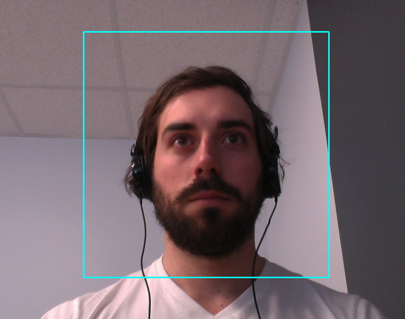
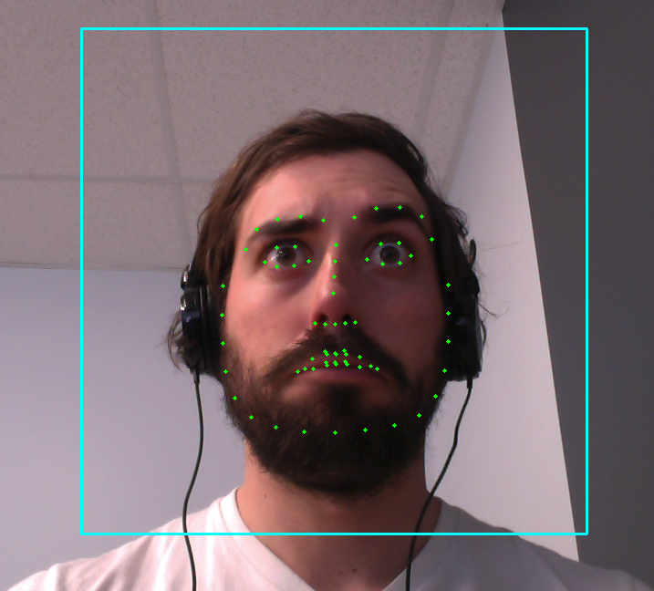
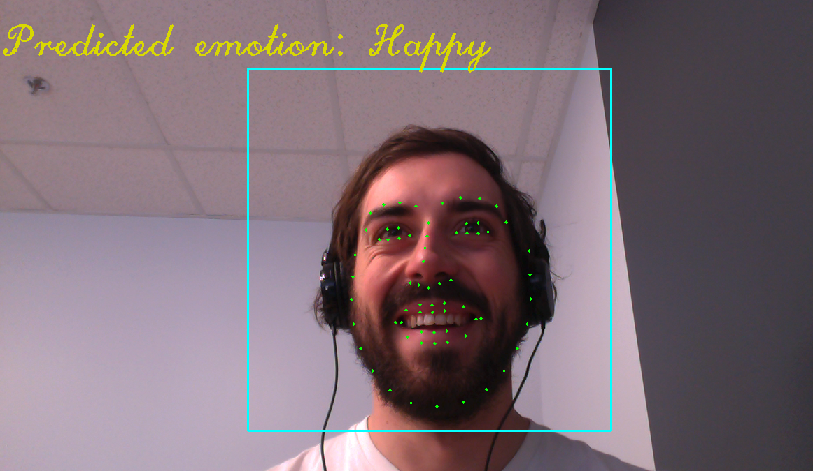

# Affective Streaming

### Facial emotion classification from a webcam

Connor Eaton - Metis 2019 - Capstone Project

### Overview

Imagine two strangers walking down the street. One of them casts a smile towards the other, the other returns with a scowl. This is a pretty typical, mundane scenario and chances are you've been on both sides of the interaction before. However, if we look deeper, incalculable complexity begins to reveal itself. 

The smiling stranger is in a good mood and is attempting to communicate their joy to the other. Perhaps the sun is shining, there are cute dogs to be pet,  they recently fell in love, or they are genuinely satisfied with the experience of life. The scowling stranger is in a bad mood and shuts down the bid for connection, chasing off the other with a harsh expression. Perhaps they just got sunburnt, barked at by a dog, broken up with, or are generally upset with life and want others to know. The two strangers may not know the exact context for the others emotions, but they instantly communicate their current state, outlook on life, and intent with nothing but the firing of a few muscles. This is nothing short of miraculous and is a foundational aspect of the human experience.

While humans intuitively percieve emotions, machines must be taught. We are communicating more and more with machines on a daily basis and as a result, we are in a unique position in history to design the future of human-machine interaction. We could adapt to machines and interact with them in a cold, impersonal, and purely rational way, or we could have machines adapt to us by building them with emotional intelligence. This ideal future could combine promises of technological innovation without sacrificing core aspects of humanity such as meaning, feeling, and subjectivity. 

My project has two parts. The first was creating a support-vector classification model to classify facial emotion from images using facial landmarks, a 68 point coordinate system that maps onto the "moving parts" of the face. Then, this model was fed into a live video stream from a wecam, where it classifies the emotion of all present faces frame by frame, and returns a prediction in real time. 

### Applications

Tempermentally, I tilt heavily towards the philosophical aspect of machine learning. I pursued this project because building emotional intelligence into machines is an amazing opportunity to design an ideal future that is optimized not only for effeciency, productivity, and comfort, but for beauty, contentment, and value. However, this project yields itself to many more immediate and pragmatic applications. Such use cases include vehicle operator safety, highly-sensitive monitoring systems for patients, improved assessment of customer satisfaction in marketing campaigns/focus groups, and so on.

### Data

I trainied my data on the Cohn-Kanade CK+ dataset which can be found [here](http://www.consortium.ri.cmu.edu/ckagree/). The dataset contained a few hundred pre-labeled images of various faces expressing the following emotions: *anger, contempt, disgust, happy, neutral, sadness, and surprise*. As the contempt and sadness categories had too few images to properly classify, they were dropped from the model. 

### Tools

Many tools were used for this project, including python, pandas, numpy, matplotlib, sklearn, keras, Dlib and openCV. For a full list of depencies, see /requirements.txt.

### Model and Results

Before building any models, I had to reduce noise in my data. To do so, I used a Haar Cascade algorithm to locate faces in images, crop the images to include only the face, and return the new image in grayscale. For example, the image fed into my model is just the portion within the blue square.

The first model I built to classify facial emotions from images was a convolutional neural network. I used the pre-existing VGG16 architecture to extract features, but used my own training layers (4) at the base, finishing with a 6 class softmax classifaction layer. This approach yield 93% validation accuracy, but was severely overfitting my data despite implementing early stopping and a dropout layer. In addition to its inaccuracy on images in the wild, the model size limited its effectiveness for real time predictions on a webcam stream.

As a result, I decided to branch away from deep learning and utilize facial landmark data. As facial landmark algorithms yield an array of 68 x,y coordinates, the feature space was much more lightweight and simple. I used Dlib's shape predictor facial landmarks algorithm to find landmarks, which you can see in the example below.

I used a support-vector machine algorithm to classifiy emotions from normalized facial landmarks with 82% accuracy. There is plenty of room for improvement in the model, but this was enough to build a minimal viable product. A sample of the real-time live stream predictions can be seen in the gif above or as a snapshot below.

### Future Work

As with any passion project, there is tremendous room for growth. Immediate improvements will be centered around training my model on more comprehensive data. Fortunately, AffectNet, a more recent and more robust prelabeled dataset for facial emotion recognition was recently released. Retraining the model on this data, which has almost half a million images will improve accuracy and increase the range of emotional categories.

In addition, emotion is just one target to classify from facial images. Currently, data can be found to train models to predict age, gender, direction of gaze, energy level, and so on. Such models can have a myriad of use for a wide range of applications.

I would also like to thank [Paul Vangent](http://www.paulvangent.com/) for providing helpful CK+ tutorials on his website, as well as the [Cohn-Kanade](http://www.consortium.ri.cmu.edu/index.php) team for providing their dataset for public use.

